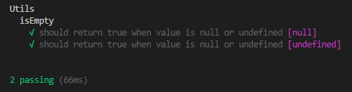

# mocha-params

_Parametrized unit tests for [Mocha](https://github.com/mochajs/mocha). Requires Mocha >=6.2_

## Installation

```sh
npm install --save-dev mocha mocha-params
```

## Example

```typescript
import { expect } from 'chai';
import { using } from 'mocha-params';
import { Utils } from './utils';

describe('Utils', () => {
    describe('isEmpty', () => {
        using(null).
        using(undefined).
            it('should return true when value is null or undefined', value => {
                const result = Utils.isEmpty(value);
                expect(result).to.equal(true);
            });
    });
});
```



## Setup

Import mocha-params into your test file:

```javascript
const using = require('mocha-params'); // javascript
```

```typescript
import { using } from 'mocha-params'; // typescript
```

Optionally, you can register mocha-params globally with mocha:

```sh
mocha -r mocha-params/register ... src/**/*.spec.js
```

This will register a global `using()` function that can be used in any test file passed to mocha.

## Usage

There are two styles you can use to parametrize your unit tests:

> `using(...)`

```javascript
// multiple arguments
using(arg1, arg2, arg3, ...). // 1st test case
using(arg4, arg5, arg6, ...). // 2nd test case
    it('expectation', (value1, value2, value3, ...[, done]) => { });
// single argument
using(arg1).
using(arg2).
    it('expectation', function(value[, done]) { });
```

or the above can be rewritten with:

> `using.cases(...)`

```javascript
// multiple arguments
using.cases(
    [arg1, arg2, arg3, ...], // 1st test case
    [arg4, arg5, arg6, ...]  // 2nd test case
).
    it('expectation', (value1, value2, value3, ...[, done]) => { });
// single argument
using.cases(arg1, arg2). // 1st and 2nd test case
    it('expectation', function(value[, done]) { });
```

### Basic parametrized test

Prepend `it` statements with `using` and pass argument to assertions:

```javascript
using(1).
    it('should be one', value => {
        expect(value).to.equal(1);
    });
```

The result will display as:

```
√ should be one [1]
```
### Multiple test cases

Chain `using` to create multiple test cases:

```javascript
using('a').
using('b').
using('c').
    it('should be a string', value => {
        expect(value).to.be.a('string');
    });
```

or:

```javascript
using.cases('a', 'b', 'c').
    it('should be a string', value => {
        expect(value).to.be.a('string');
    });
```

The result will display as:

```
√ should be a string ["a"]
√ should be a string ["b"]
√ should be a string ["c"]
```

### Multiple arguments

Pass multiple arguments to `using` and use them in `it` statements:

```javascript
using(1, 'bus').
using(2, 'cars').
    it('should be a number followed by a string', (amount, title) => {
        expect(amount + ' ' + title).to.match(/^[0-9]\s[a-z]+$/);
    });
```

or

```javascript
using.cases(
    [1, 'bus'],
    [2, 'cars']
).
it('should be a number followed by a string', (amount, title) => {
    expect(amount + ' ' + title).to.match(/^[0-9]\s[a-z]+$/);
});
```

The result will display as:

```
√ should be a number followed by a string [1, "bus"]
√ should be a number followed by a string [2, "cars"]
```

Please note that the number of arguments per test case must be the same. Otherwise `using` or `using.cases` will throw an error. For example the following will fail:

```javascript
using(1, 'bus').using(2).it('a', n => { });
// ^^^ WILL THROW AN ERROR ^^^
```

## Async

Add the `done` argument at the end of argument list in `it` statements:

```javascript
using(1, 'bus').
using(2, 'cars').
    it("should be a number followed by a string", (amount, title, done) => {
        expect(amount + ' ' + title).to.match(/^[0-9]\s[a-z]+$/);
        done();
    });
```

## Other features

Pending unit tests are supported the same way as Mocha does:

```javascript
using(true).it('pending unit test'); // assertion not supplied
using(true).xit('pending', value => { }); // xit
using(true).it.skip('pending', value => { }); // it.skip
using(true).it('pending', function(value) { this.skip(); }); // this.skip
```

Focus on specific test cases:

```javascript
using(true).it.only('focused', value => { });
```

Timeout, retries and slow:

```javascript
// timeout
using(true).it('timeout', value => { }).timeout(20);
using(true).it('timeout', function(value) { this.timeout(20); });
// retries
using(true).it('retries', value => { }).retries(4);
using(true).it('retries', function(value) { this.retries(4); });
// slow
using(true).it('slow', value => { }).slow(50);
using(true).it('slow', function(value) { this.slow(50); });
```


## License

MIT